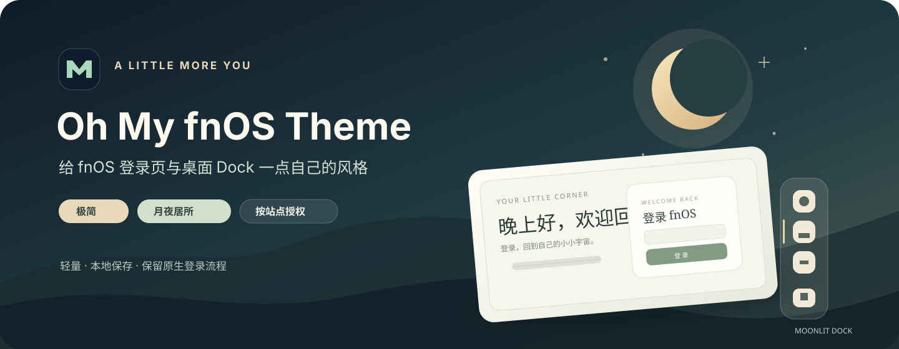

<div align="center">
  
  <h1>Oh My fnOS Theme</h1>
  <p>为 fnOS 登录页与桌面 Dock 换上你喜欢的样子。</p>
  <p>
    <a href="https://github.com/Nyakooo/oh-my-fn-theme/blob/master/LICENSE"></a>
    
    
  </p>
  <p><a href="README.md">简体中文</a> · <a href="README.en.md">English</a></p>
</div>

<p align="center"></p>

## 功能

- **两套登录主题**：极简与月夜居所可用于 fnOS 登录页。
- **紧凑 Dock**：首页保留 fnOS 原生外观，只调整 Dock 的纵向尺寸；月夜居所增加暖色选中状态。
- **浏览器标签外观**：自定义标签标题和 favicon。
- **明确授权**：只为用户手动添加并授权的 fnOS 地址运行，不扫描其他站点。
- **保留原登录流程**：只调整页面布局与样式，不替换登录表单或认证逻辑。

## 预览

| 登录页主题 | fnOS 桌面 Dock |
| --- | --- |
| [打开登录页预览](preview.html) | [打开桌面预览](desktop-preview.html) |
| [打开内部桌面预览](internal-preview.html) | 可在首页预览中切换两种主题 |

预览页面使用本地示例数据，不连接 NAS。桌面预览仅用于查看 Dock 设计示意；扩展在首页只调整 Dock，其他元素保留 fnOS 原生样式。

## 安装

### 从源码加载（本地测试）

1. 下载或克隆本仓库。
2. 在 Chrome 打开 `chrome://extensions`，或在 Edge 打开 `edge://extensions`。
3. 启用**开发者模式**，点击**加载已解压的扩展程序**。
4. 选择仓库中的 `dist/oh-my-fn-theme-0.1.10` 目录；若尚未生成，先在仓库根目录运行 `npm run build`。
5. 打开扩展设置，输入 fnOS 根地址（例如 `http://192.168.1.20:5666`），确认展示的地址并在浏览器原生弹窗中授权。
6. 刷新 fnOS 页面即可应用外观。

也可以下载 `dist/oh-my-fn-theme-0.1.10.zip`，解压后在扩展管理页加载解压目录。ZIP 是未签名的开发者模式扩展包，不是 Chrome Web Store 安装包。

### 地址规则

地址必须是 `http://` 或 `https://` 根地址，可以带端口，但不能包含路径、查询参数、片段、用户名或密码。权限精确到主机和端口，并覆盖该端口下的页面路径。不同子域名、端口或跳转主机需要分别授权。

## 开发

运行环境：Node.js 20 或更高版本。扩展本身使用 Chromium 扩展 API 和原生 JavaScript、CSS，不需要第三方运行时依赖。

```sh
npm run build
```

命令会读取 `manifest.json` 的版本号，生成：

- `dist/oh-my-fn-theme-<版本>/`：可在 Chrome / Edge 中加载的扩展目录。
- `dist/oh-my-fn-theme-<版本>.zip`：便于本地传递和备份的 ZIP 包。

构建过程会检查 manifest 图标文件引用。修改扩展代码后重新运行命令即可更新安装目录和 ZIP。`dist/` 已加入 `.gitignore`。

## 权限与隐私

扩展声明 `activeTab`、`scripting`、`storage` 和可选的 HTTP/HTTPS 站点权限。安装时不会获得 NAS 站点权限；只有用户在设置页确认并通过浏览器授权后，扩展才会在该地址注册内容脚本。保存的数据仅包括已确认地址、外观设置和用户选择的 favicon，存放于浏览器本地扩展存储。扩展不读取密码、Cookie 或网络请求，不拦截表单，也不连接外部服务。

移除地址会注销对应的动态内容脚本并撤销该站点权限。移除扩展可清除浏览器保存的扩展数据。

## 兼容性与限制

- Chrome 与 Edge，Manifest V3。
- fnOS 页面 DOM 结构会随系统版本变化；登录面板与 Dock 的自动识别需要目标设备验证。
- 目前没有自动化浏览器测试。提交前请至少在目标 fnOS 版本上检查地址授权、登录页布局、表单提交流程、主题切换与 Dock 展示。

## 反馈与贡献

欢迎通过 [GitHub Issues](https://github.com/Nyakooo/oh-my-fn-theme/issues) 报告问题或提出功能建议。反馈时请注明浏览器及版本、fnOS 版本、页面类型和复现步骤；请勿提交密码、Cookie、公开可访问的 NAS 地址或其他敏感信息。

贡献代码前请先开 Issue 讨论较大的改动。提交 PR 时请说明改动目的和验证方式，并确认 `npm run build` 可以成功生成本地扩展包。

## 许可证

本项目以 [MIT License](LICENSE) 发布。
